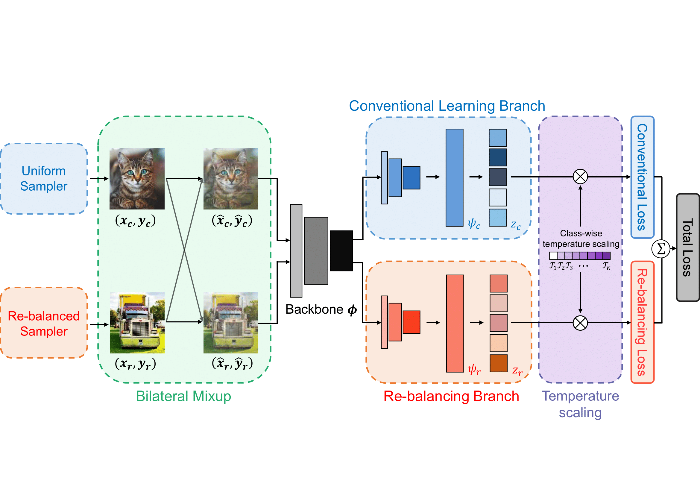

# __DBN-Mix: Training dual branch network using bilateral mixup augmentation for long-tailed visual recognition__ 

__*Jae Soon Baik, In Young Yoon, Jun Won Choi*__

Official implementation for [the paper](https://www.sciencedirect.com/science/article/pii/S003132032300804X) presented on Pattern Recognition 2024 titled "DBN-Mix: Training dual branch network using bilateral mixup augmentation for long-tailed visual recognition". (Pytorch implementation)  
</img>

# Abstract
There is growing interest in the challenging visual perception task of learning from long-tailed class distributions. The extreme class imbalance in the training dataset biases the model to prefer recognizing majority class data over minority class data. Furthermore, the lack of diversity in minority class samples makes it difficult to find a good representation. In this paper, we propose an effective data augmentation method, referred to as bilateral mixup augmentation, which can improve the performance of long-tailed visual recognition. The bilateral mixup augmentation combines two samples generated by a uniform sampler and a re-balanced sampler and augments the training dataset to enhance the representation learning for minority classes. We also reduce the classifier bias using class-wise temperature scaling, which scales the logits differently per class in the training phase. We apply both ideas to the dual-branch network (DBN) framework, presenting a new model, named dual-branch network with bilateral mixup (DBN-Mix). Experiments on popular long-tailed visual recognition datasets show that DBN-Mix improves performance significantly over baseline and that the proposed method achieves state-of-the-art performance in some categories of benchmarks.

## Prerequisites:   
- Linux
- Python 3.5/3.6
- CPU compatible but NVIDIA GPU + CUDA CuDNN is highly recommended.
- torch==1.7.1
- torchvision==0.8.2
- numpy==1.19.4
- matplotlib==3.3.3
- Pillow==8.1.0

## Running DBN-Mix on benchmark datasets (CIFAR-10 and CIFAR-100)
```
bash experiments/cifar10.sh
bash experiments/cifar100.sh
```

## Citation
```
@article{baik2024dbn,
  title={DBN-Mix: Training dual branch network using bilateral mixup augmentation for long-tailed visual recognition},
  author={Baik, Jae Soon and Yoon, In Young and Choi, Jun Won},
  journal={Pattern Recognition},
  volume={147},
  pages={110107},
  year={2024},
  publisher={Elsevier}
}
```
## Note
Our code is based on [LDAM](https://github.com/kaidic/LDAM-DRW).  

